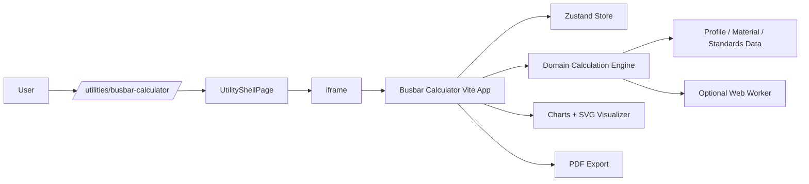
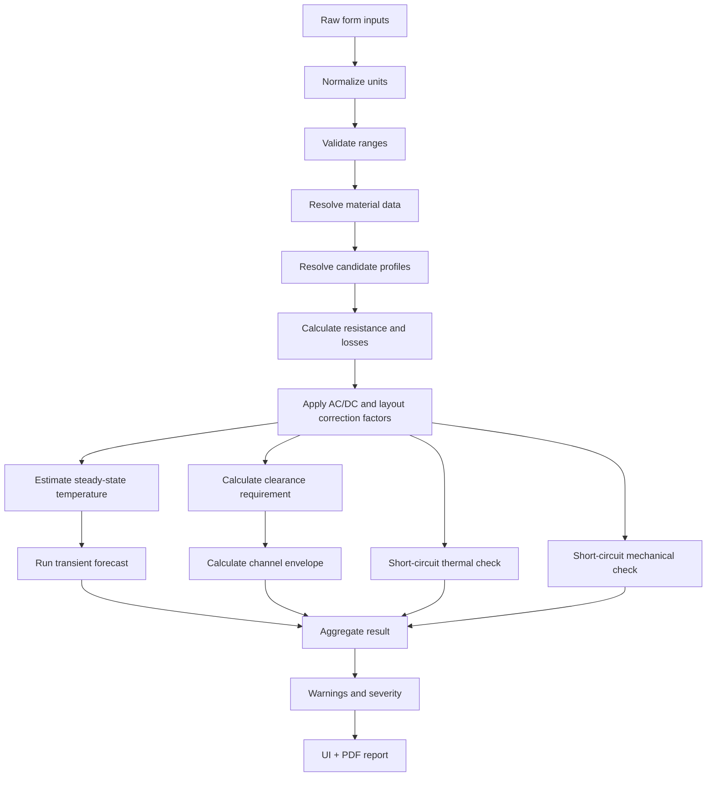

# Technical Architecture

## 1. Architecture summary

The Busbar Calculator should be a standalone React + TypeScript utility app, built by Vite and embedded in the CAD AutoScript Docusaurus shell.



## 2. Top-level source structure

```text
apps/busbar-calculator/src/
  main.tsx
  App.tsx
  styles/
    tokens.css
    app.css
    print.css

  components/
    layout/
      AppShell.tsx
      HeaderBar.tsx
      Panel.tsx
      EngineeringBadge.tsx
    inputs/
      ProjectMetadataForm.tsx
      ElectricalInputs.tsx
      MaterialSelector.tsx
      ProfileSelector.tsx
      LayoutSelector.tsx
      EnvironmentInputs.tsx
      ShortCircuitInputs.tsx
    visualizer/
      BusbarCrossSection.tsx
      PhaseArrangementPreview.tsx
      ClearanceCallouts.tsx
      ChannelEnvelopeOverlay.tsx
      SupportSpacingDiagram.tsx
    charts/
      TemperatureForecastChart.tsx
      LossesChart.tsx
      CandidateComparisonChart.tsx
    results/
      ResultSummary.tsx
      CandidateTable.tsx
      ThermalPanel.tsx
      ClearancePanel.tsx
      ShortCircuitPanel.tsx
      WarningsPanel.tsx
    export/
      ExportToolbar.tsx
      PdfReportButton.tsx
      JsonExportButton.tsx

  domain/
    types/
      units.ts
      project.ts
      electrical.ts
      materials.ts
      profiles.ts
      layout.ts
      thermal.ts
      shortCircuit.ts
      report.ts
    calculations/
      selectProfiles.ts
      resistance.ts
      currentDensity.ts
      losses.ts
      thermalSteadyState.ts
      thermalForecast.ts
      clearance.ts
      channelEnvelope.ts
      shortCircuitThermal.ts
      shortCircuitMechanical.ts
      validateConfiguration.ts
    standards/
      standardRegistry.ts
      din43670.ts
      din43671.ts
      iec60664.ts
      iec61439.ts
      iec60865.ts
    validation/
      inputLimits.ts
      warningRules.ts
      resultSeverity.ts

  data/
    profiles.copper.example.json
    profiles.aluminium.example.json
    materials.json
    coolingPresets.json
    clearanceRules.example.json
    arrangementPresets.json

  state/
    useBusbarStore.ts
    defaults.ts
    selectors.ts
    persistence.ts

  export/
    pdf/
      buildPdfReport.ts
      drawReportHeader.ts
      drawInputTables.ts
      drawCharts.ts
      drawCalculationTrace.ts
    json/
      serializeProject.ts
      importProject.ts
    images/
      svgToPng.ts
      canvasCapture.ts
    fileNames.ts

  workers/
    calculationWorker.ts
    workerClient.ts
    protocol.ts

  tests/
    goldenCases/
      copper-3phase-1600a-natural.json
      aluminium-3phase-2500a-forced.json
```

## 3. Core boundaries

### 3.1 UI layer

The UI layer renders forms, visualizations, charts and messages. It may format numbers but must not implement engineering formulas directly.

Allowed:

```tsx
const result = useBusbarStore(selectCalculationResult);
```

Not allowed:

```tsx
const loss = current * current * resistivity * length / area;
```

### 3.2 Domain layer

The domain layer is pure TypeScript. It must not import React, Zustand, DOM APIs, CSS or Docusaurus aliases.

Rules:

- deterministic functions;
- typed inputs and outputs;
- no side effects except explicitly marked diagnostic logging;
- formulas grouped by topic;
- all assumptions returned as warnings or method notes;
- easy to test with Vitest.

### 3.3 Data layer

The data layer contains versioned JSON/TS datasets:

- busbar profiles;
- material properties;
- clearance rules;
- cooling presets;
- arrangement presets;
- standard metadata.

Every dataset must include:

```ts
sourceId: string;
sourceType: 'licensed-standard-table' | 'vendor-catalog' | 'project-rule' | 'engineering-default' | 'example-only';
revision: string;
reviewStatus: 'draft' | 'reviewed' | 'approved' | 'deprecated';
```

### 3.4 State layer

Use Zustand for UI/app state:

```text
projectSlice       metadata, report id, revision
inputSlice         electrical/environment/material/profile inputs
layoutSlice        selected arrangement, spacing, orientation
resultSlice        computed result, candidates, warnings
exportSlice        PDF status, last export timestamp
uiSlice            active tabs, collapsed sections, chart options
```

Persist only:

- user preferences;
- last non-sensitive defaults;
- local project drafts if user explicitly saves.

Do not persist:

- generated PDF binary buffers;
- hidden calculation states;
- credentials;
- personal data unless explicitly exported/imported.

## 4. Calculation pipeline



## 5. Web Worker strategy

The MVP can run on the main thread if calculations are fast. Add a worker when:

- candidate sweeps exceed 100 profiles/layout combinations;
- thermal forecast resolution becomes high;
- future CAD geometry is generated;
- charts become expensive;
- UI responsiveness drops.

Worker protocol:

```ts
export type CalculationWorkerRequest =
  | {type: 'calculate'; payload: BusbarCalculationInput; requestId: string}
  | {type: 'generateForecast'; payload: ThermalForecastInput; requestId: string};

export type CalculationWorkerResponse =
  | {type: 'calculationResult'; payload: BusbarCalculationResult; requestId: string}
  | {type: 'workerError'; message: string; requestId: string};
```

## 6. Rendering strategy

### 6.1 Cross-section preview

Use SVG for the main 2D busbar cross-section because:

- it scales cleanly;
- labels and callouts are easy;
- it can be exported into PDF;
- it works inside an iframe without heavy dependencies.

### 6.2 Charts

Use a lightweight chart implementation. If a library is added, prefer a minimal dependency. The first version can use SVG paths directly for temperature/time charts.

### 6.3 PDF capture

For PDF reports, generate vector tables and text with jsPDF. Convert the SVG cross-section and chart paths to image only if vector embedding is too time-consuming.

## 7. Error handling

Every calculation should return structured warnings:

```ts
export type CalculationWarning = {
  code: string;
  severity: 'info' | 'warning' | 'error';
  title: string;
  message: string;
  affectedResultIds: string[];
  recommendedAction?: string;
};
```

Examples:

- `CLEARANCE_TABLE_NOT_APPROVED`
- `TEMPERATURE_MODEL_ESTIMATE_ONLY`
- `AC_PROXIMITY_FACTOR_APPROXIMATED`
- `SHORT_CIRCUIT_IPEAK_MISSING`
- `PROFILE_OUTSIDE_DATASET_RANGE`
- `AMBIENT_ABOVE_VALIDATION_RANGE`

## 8. Versioning

The calculation engine must expose a version:

```ts
export const calculationEngineVersion = '0.1.0';
```

Each exported project/report should include:

- app version;
- calculation engine version;
- dataset revisions;
- report generation timestamp;
- input hash.

## 9. Optional backend architecture

A backend is not required for MVP. If introduced later, recommended endpoints are:

```text
GET  /api/v1/busbar/materials
GET  /api/v1/busbar/profiles
GET  /api/v1/busbar/standard-datasets
POST /api/v1/busbar/calculate
POST /api/v1/busbar/reports/render
POST /api/v1/busbar/cad/export
```

Use backend only when there is clear value:

- shared approved datasets;
- authenticated saved projects;
- traceable report archive;
- CAD automation service;
- heavy batch calculations.

## 10. Security model

MVP security model:

- no uploads to server;
- report metadata sanitized;
- JSON imports schema-validated;
- no `eval` or remote code;
- no third-party scripts loaded from CDN;
- PDF generation uses local data only;
- app works inside the existing iframe shell.

## 11. Performance targets

| Operation | Target |
|---|---:|
| Form field recalculation | < 150 ms |
| Candidate table update | < 300 ms |
| Thermal forecast graph update | < 500 ms |
| PDF generation, normal report | < 3 s |
| App initial load inside shell | < 2.5 s on normal broadband |

## 12. Development quality gates

Before merging:

- `pnpm typecheck:busbar` passes;
- `pnpm test:busbar` passes;
- `pnpm build:busbar` emits `app.html`;
- Docusaurus host build passes;
- at least one report-generation smoke test passes;
- golden calculation outputs are unchanged or intentionally updated.
